# 🌱 AeroLeaf - Blockchain Carbon Credit Platform

**Revolutionizing Carbon Markets Through Satellite Verification & Blockchain Technology**

[](https://opensource.org/licenses/MIT)
[](https://nodejs.org/)
[](https://reactjs.org/)
[](https://python.org/)
[](https://soliditylang.org/)

_Bringing transparency and reliability to the carbon credit market through cutting-edge satellite imagery analysis and blockchain-based validation._
<div align="center">

[🚀 Quick Start](#-quick-start-guide) • [📖 Documentation](#-documentation) • [🎯 Features](#-key-features) • [🛠️ Tech Stack](#-technology-stack) • [🌐 Demo](#-demo-accounts)

</div>

---

## 🌍 Overview

AeroLeaf is a comprehensive platform that transforms the carbon credit market by providing **verifiable proof** of reforestation projects through satellite imagery analysis and blockchain technology. Our mission is to create a transparent, decentralized ecosystem where environmental impact can be accurately measured, verified, and traded.

### 🎯 Our Vision

Create a trustworthy carbon credit marketplace where every transaction is backed by real environmental data and immutable blockchain records.

### 🌟 Why AeroLeaf?

- **🛰️ Satellite Verification**: Real-time monitoring using Sentinel-2 imagery
- **🔗 Blockchain Transparency**: Immutable records of all verification processes
- **🤖 AI-Powered Analysis**: Machine learning for accurate carbon sequestration estimates
- **🌐 Decentralized Marketplace**: Direct connection between landowners and investors
- **📊 Real-time Insights**: Comprehensive dashboard with live project monitoring

---

## 🚀 Key Features

### 🛰️ **Satellite-Based Verification**

- **NDVI Analysis**: Time-series vegetation monitoring using Normalized Difference Vegetation Index
- **Before/After Comparison**: Visual evidence of reforestation progress
- **Automated Detection**: AI-powered anomaly detection for site monitoring
- **Multi-temporal Analysis**: Historical data comparison for trend analysis

### 🔗 **Blockchain Integration**

- **NFT Carbon Credits**: Each credit is an ERC-721 token with unique metadata
- **Smart Contract Verification**: Automated verification workflows
- **Immutable Records**: Complete audit trail of all transactions
- **Cross-chain Compatibility**: Built for Polygon network (low fees)

### 📊 **Interactive Dashboard**

- **Real-time Monitoring**: Live updates from satellite data
- **3D Visualizations**: Immersive site exploration with Three.js
- **Market Analytics**: Trading insights and price trends
- **Project Timeline**: Milestone tracking and progress visualization

### 🤖 **AI & Machine Learning**

- **Carbon Estimation**: ML algorithms for precise carbon sequestration calculations
- **Predictive Analysis**: Future project outcome predictions
- **Pattern Recognition**: Automated vegetation growth detection
- **Data Processing**: Efficient handling of large satellite datasets

### 🌐 **Marketplace Features**

- **Credit Trading**: Buy, sell, and retire carbon credits
- **Dynamic Pricing**: Market-driven price discovery
- **Project Funding**: Direct investment in reforestation projects
- **Portfolio Management**: Track your environmental impact

## 🚦 Quick Start Guide

### Prerequisites

- Node.js (v16 or higher)
- Python (v3.8 or higher)
- Git
- Windows, macOS, or Linux

### Installation & Setup

1. **Clone the Repository**

   ```bash
   git clone https://github.com/DS-Kushagra/Aeroleaf.git
   cd aeroleaf
   ```

2. **Initial Setup**

   Run the setup script to install all dependencies, initialize the database, and compile smart contracts:

   ```bash
   ./setup.bat
   ```

3. **Starting the Application**

   **Option 1**: Start all services at once:

   ```bash
   ./start-all.bat
   ```

   **Option 2**: Start services separately:

   ```bash
   ./start-backend.bat
   ```

   In another terminal:

   ```bash
   ./start-frontend.bat
   ```

4. **Accessing the Application**
   - Frontend: http://localhost:5173
   - Backend API: http://localhost:5000/api
   - API Documentation: http://localhost:5000/docs

For more detailed setup instructions, see [INSTALLATION.md](./docs/INSTALLATION.md).

## 📝 Recent Updates

The following improvements were recently implemented:

1. **API Documentation Fix**: The Swagger UI now displays correctly at http://localhost:5000/docs

2. **Frontend API Service**: Added a centralized API service for frontend components to interact with the backend

3. **API Proxy Configuration**: The frontend's Vite config now proxies API requests to avoid CORS issues

4. **Status Banner**: Added a status banner to display API connection status and development mode information

5. **Component Fixes**: Corrected React component syntax in ReviewSites.jsx to use proper function components

6. **Enhanced Batch Scripts**: Updated start-all.bat with dependency checks and better sequencing

7. **Database Initialization**: Corrected paths in the database initialization script

8. **Animation Enhancement**: Integrated framer-motion for improved UI animations

For more detailed execution information, see [RUNNING.md](./RUNNING.md).

## 👥 Demo Accounts

Use these test accounts to explore different roles in the system:

1. **Investor Account:**

   - Email: alice@example.com
   - Password: password123
   - Role: Carbon credit buyer and investor in reforestation projects

2. **Landowner Account:**

   - Email: bob@example.com
   - Password: password123
   - Role: Owner of land used for reforestation projects

3. **Verifier Account:**
   - Email: charlie@example.com
   - Password: password123
   - Role: Independent verifier who confirms reforestation progress

## 📁 Project Structure

```
AeroLeaf/
├── frontend/               # React application with Vite
│   └── aeroleaf-frontend/  # Frontend source code
├── backend/                # Node.js Express server
│   ├── api/                # API endpoints
│   ├── controllers/        # Request handlers
│   ├── models/             # Data models
│   ├── routes/             # API routes
│   └── services/           # Business logic
├── blockchain/             # Smart contract codebase
│   ├── contracts/          # Solidity smart contracts
│   └── test/               # Contract test scripts
├── ml/                     # Machine learning components
│   ├── data/               # Sentinel satellite imagery
│   └── results/            # Analysis outputs
├── data/                   # Sample data for development
├── docs/                   # Extended documentation
└── scripts/                # Utility scripts
```

## 💻 Technology Stack

### Frontend

- **Framework**: React.js with Vite
- **State Management**: Context API, React Hooks
- **UI Components**: Custom components with Tailwind CSS
- **Maps & Visualization**: Leaflet maps, Nivo charts, Three.js
- **Animation**: Framer Motion, GSAP

### Backend

- **Server**: Node.js, Express
- **Database**: Firebase/Firestore
- **Authentication**: Firebase Auth
- **API Documentation**: Swagger UI

### Blockchain

- **Smart Contracts**: Solidity (ERC-721)
- **Development Framework**: Hardhat
- **Network**: Polygon (for lower transaction fees)
- **Web3 Integration**: ethers.js

### Data & ML

- **Satellite Data**: Sentinel-2 imagery
- **Analysis**: NDVI processing, carbon estimation
- **Python Libraries**: numpy, matplotlib, scikit-learn
- **GIS Processing**: Earth Engine API

## Main Features

1. **Interactive Dashboard**

   - Real-time monitoring of reforestation sites
   - Comprehensive NDVI progress visualization
   - Carbon credit statistics and market trends

2. **Satellite-based Verification**

   - Time-series NDVI (Normalized Difference Vegetation Index) analysis
   - Before/after visual comparison of reforestation sites
   - Automated vegetation growth detection

3. **Blockchain Transparency**

   - Smart contract-based verification records
   - Carbon credits issued as NFTs with complete audit trail
   - Immutable record of verification history

4. **Carbon Credit Marketplace**

   - Buy, sell, and retire carbon credits from verified projects
   - Real-time pricing based on market demand
   - Direct connection between investors and landowners

5. **AI-Powered Analysis**
   - Machine learning algorithms for carbon sequestration estimation
   - Automated anomaly detection for site monitoring
   - Predictive analysis for reforestation project outcomes

---

## 🎮 How It Works

### 🔄 **Carbon Credit Lifecycle**

```mermaid
graph TD
    A[🌱 Reforestation Project] --> B[� Satellite Monitoring]
    B --> C[🤖 AI Analysis]
    C --> D[✅ Verification]
    D --> E[⛓️ NFT Minting]
    E --> F[🏪 Marketplace]
    F --> G[💰 Trading]
    G --> H[🔒 Retirement]
```



### 📋 **Step-by-Step Process**

1. **🌱 Project Registration**: Landowners register reforestation sites
2. **📊 Baseline Establishment**: Initial satellite imagery analysis
3. **🕐 Monitoring Period**: Continuous NDVI tracking (12-24 months)
4. **🤖 AI Verification**: Machine learning validates growth patterns
5. **✅ Human Review**: Expert verification of AI results
6. **⛓️ Credit Issuance**: NFT tokens minted on blockchain
7. **🏪 Market Listing**: Credits available for purchase
8. **🔒 Retirement**: Final use removes credits from circulation

---

## 🚀 API Endpoints

### 🔧 **Core APIs**

<details>
<summary>📊 <strong>Site Management</strong></summary>

```javascript
// Get all reforestation sites
GET /api/sites

// Get specific site details
GET /api/sites/:id

// Create new site
POST /api/sites
{
  "name": "Amazon Restoration Site 1",
  "location": { "lat": -3.7327, "lng": -38.5267 },
  "area": 100.5,
  "owner": "landowner_id"
}

// Update site information
PUT /api/sites/:id

// Delete site
DELETE /api/sites/:id
```

</details>

<details>
<summary>📈 <strong>NDVI Analytics</strong></summary>

```javascript
// Get NDVI data for site
GET /api/sites/:id/ndvi

// Get historical NDVI trends
GET /api/sites/:id/ndvi/history

// Trigger new NDVI analysis
POST /api/sites/:id/analyze

// Get carbon estimation
GET /api/sites/:id/carbon-estimate
```

</details>

<details>
<summary>🏪 <strong>Marketplace</strong></summary>

```javascript
// List available credits
GET /api/marketplace/credits

// Buy carbon credits
POST /api/marketplace/buy
{
  "creditId": "credit_123",
  "quantity": 10,
  "price": 25.50
}

// Retire credits
POST /api/marketplace/retire
{
  "creditId": "credit_123",
  "reason": "Corporate offsetting 2024"
}
```

</details>

<details>
<summary>⛓️ <strong>Blockchain Integration</strong></summary>

```javascript
// Get contract info
GET /api/blockchain/contract

// Verify transaction
GET /api/blockchain/verify/:txHash

// Get NFT metadata
GET /api/blockchain/nft/:tokenId
```

</details>

---

## 🧪 Testing & Development

### 🔬 **Running Tests**

```bash
# Backend API tests
cd backend && npm test

# Frontend component tests
cd frontend/aeroleaf-frontend && npm test

# Smart contract tests
cd blockchain && npx hardhat test

# ML processing tests
cd ml && python -m pytest

# Integration tests
npm run test:integration
```

### 🛠️ **Development Workflow**

```bash
# Install development dependencies
npm run install:dev

# Start development servers with hot reload
npm run dev

# Run code formatting
npm run format

# Run linting
npm run lint

# Build for production
npm run build

# Deploy to staging
npm run deploy:staging
```

### 📊 **Performance Monitoring**

- **Frontend**: Lighthouse performance audits
- **Backend**: Response time monitoring with Winston
- **Blockchain**: Gas optimization analysis
- **ML**: Processing time and accuracy metrics

---

## 🛡️ Security Features

### 🔐 **Authentication & Authorization**

- JWT-based authentication with refresh tokens
- Role-based access control (RBAC)
- Firebase Authentication integration
- Multi-factor authentication support

### 🛡️ **API Security**

- Rate limiting to prevent abuse
- Helmet.js for security headers
- CORS configuration
- Input validation and sanitization

### ⛓️ **Blockchain Security**

- OpenZeppelin audited contracts
- Multi-signature wallet support
- Reentrancy protection
- Access control modifiers

### 🔒 **Data Protection**

- HTTPS enforcement
- Environment variable encryption
- Secure API key management
- GDPR compliance measures

---

## 🌟Demo

### 🖥️ **Main Dashboard**

> 📺 **Live Demo**: [Demo will be available soon]
>
> 🎥 **Video Walkthrough**: [YouTube demo coming soon]

---

## 🤝 Contributing

We welcome contributions from the community! Here's how you can help:

### 🎯 **Ways to Contribute**

- 🐛 **Bug Reports**: Found an issue? [Create an issue](https://github.com/DS-Kushagra/AeroLeaf/issues)
- ✨ **Feature Requests**: Have an idea? Share it with us!
- 🔧 **Code Contributions**: Submit pull requests for improvements
- 📚 **Documentation**: Help improve our docs
- 🧪 **Testing**: Add test cases and improve coverage

### 📋 **Development Guidelines**

1. **Fork the Repository**

   ```bash
   git fork https://github.com/DS-Kushagra/AeroLeaf.git
   ```

2. **Create Feature Branch**

   ```bash
   git checkout -b feature/amazing-feature
   ```

3. **Follow Code Standards**

   - ESLint for JavaScript/React
   - PEP 8 for Python
   - Solidity style guide for smart contracts

4. **Write Tests**

   - Unit tests for all new functions
   - Integration tests for API endpoints
   - Component tests for React components

5. **Submit Pull Request**
   - Clear description of changes
   - Link to related issues
   - Include screenshots for UI changes

### 🎖️ **Contributors**

<div align="center">

| Avatar | Name                 | Role               | Contributions                       |
| ------ | -------------------- | ------------------ | ----------------------------------- |
| 👨‍💻     | **Kushagra Agrawal** | Lead Developer     | Architecture, Blockchain, Backend   |
| 👨‍💻     | **Moulik Zinzala**   | Frontend Developer | Architecture, UI/UX, AI/ML System   |

</div>

---

## 📚 Documentation

### 📖 **Complete Guides**

| 📄 Document                                     | 📝 Description              |
| ----------------------------------------------- | --------------------------- |
| [📦 Installation Guide](./docs/INSTALLATION.md) | Detailed setup instructions |
| [👤 User Manual](./docs/USER_GUIDE.md)          | How to use the platform     |
| [👨‍💻 Developer Guide](./docs/DEVELOPER_GUIDE.md) | Development workflows       |
| [🔑 Authentication](./docs/AUTHENTICATION.md)   | Auth implementation details |
| [🔐 API Reference](./docs/API.md)               | Complete API documentation  |


---

## 🚀 Roadmap

### 🎯 **Phase 1: Core Platform** ✅

- [x] Advanced dashboard and UI
- [x] Satellite data integration
- [x] Smart contract development
- [x] User authentication

### 🔄 **Phase 2: Enhanced Features** 🚧

- [ ] Advanced ML algorithms
- [ ] Mobile application
- [ ] API rate limiting
- [ ] Performance optimization

### 🌟 **Phase 3: Scale & Deploy** 📅

- [ ] Mainnet deployment
- [ ] Production infrastructure
- [ ] Partnership integrations
- [ ] Marketing and adoption

### 🔮 **Future Enhancements**

- [ ] IoT sensor integration
- [ ] Drone imagery support
- [ ] Cross-chain compatibility
- [ ] AI-powered predictions

---

## ⚠️ Known Issues & Limitations

### 🐛 **Current Issues**

- Satellite data processing can be slow for large areas
- Blockchain transactions require testnet tokens
- Some animations may lag on older devices

### 🔧 **Planned Fixes**

- Implement data caching for faster loading
- Add faucet for automatic testnet token distribution
- Optimize animations for better performance

### 💡 **Workarounds**

- Use smaller area selections for faster processing
- Request testnet tokens from official faucets
- Disable animations in browser settings if needed

---

## 📄 License

This project is licensed under the **MIT License** - see the [LICENSE](LICENSE) file for details.

### � **License Summary**

- ✅ Commercial use allowed
- ✅ Modification allowed
- ✅ Distribution allowed
- ✅ Private use allowed
- ❌ No warranty provided
- ❌ No liability accepted

---

## 📞 Contact & Support

<div align="center">

### 👥 **Meet the Team**

|               👨‍💻 **Kushagra Agrawal**               |                 👨‍💻 **Moulik Zinzala**                 |
| :-------------------------------------------------: | :----------------------------------------------------: |
|         Lead Developer & Blockchain Expert          |          Frontend Developer & AI Expert                |
|           📧 kushagraagrawal128@gmail.com           |             📧 moulikzinzala912@gmail.com             |
| 🐙 [GitHub Profile](https://github.com/DS-Kushagra) | 🐙 [GitHub Profile](https://github.com/Moulik-23)     |

</div>

### 🌐 **Project Links**

📂 **Repository**: [github.com/DS-Kushagra/AeroLeaf](https://github.com/DS-Kushagra/AeroLeaf)  
🌍 **Website**: Coming Soon  
📺 **Demo**: Coming Soon  

### 💬 **Get Help**

- 🔍 **Issues**: [GitHub Issues](https://github.com/DS-Kushagra/AeroLeaf/issues)
- 💡 **Discussions**: [GitHub Discussions](https://github.com/DS-Kushagra/AeroLeaf/discussions)
- 📚 **Documentation**: [Project Wiki](https://github.com/DS-Kushagra/AeroLeaf/wiki)


---

<div align="center">

### 🌱 **Together, let's build a sustainable future!**

**Made with ❤️ for the planet**

_AeroLeaf - Where technology meets sustainability_
</div>
